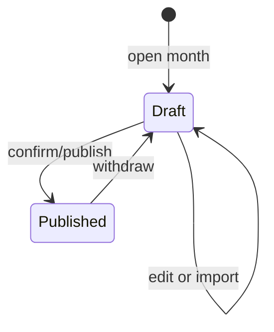
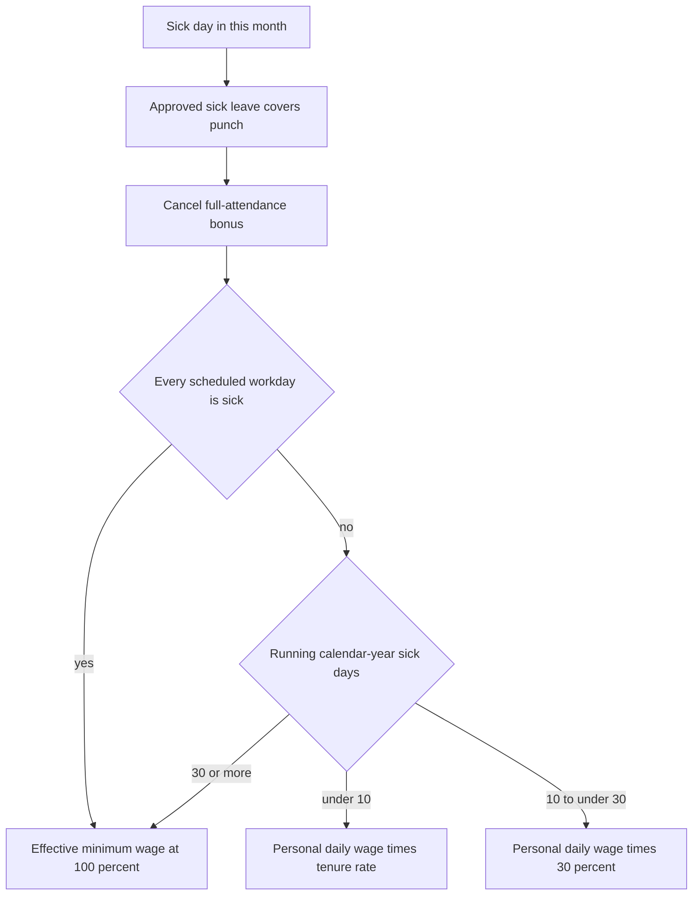
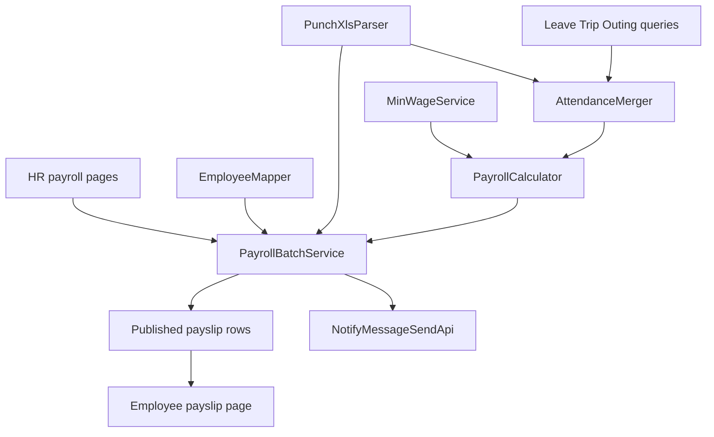

# Monthly Payroll Batch - Plan

## Goal Capsule

- **Objective:** HR closes each month's attendance and payable salary inside OA, without rebuilding deductions in a spreadsheet. Employees see only published payslips for their own history.
- **Means:** HRM monthly payroll batch (KTD1).
- **Product authority:** Product Contract Rs. Then Planning Contract KTDs. Then unit Approaches.
- **Stop conditions:** Stop if a change would alter R11 sick-pay brackets, R2/R3 publish lock, or move work out of HRM after KTD1.
- **Execution profile:** Test-first on the calculator and attendance merger. UI follows existing HRM Ant Design pages.
- **Tail ownership:** Land on the current feature branch. Add menu/dict SQL to the release board. Do not treat finance 薪资付款 as in scope.

---

## Product Contract

### Summary

HR runs one payroll batch per month: upload the attendance-machine export, merge approved leave/outing/trip, produce an attendance list and payable draft, then confirm/publish so employees can open their payslip.
Tax, overtime, and other adjustments are filled or imported by hand.
Published months lock until withdrawn.

### Problem Frame

HR currently seeds a salary workbook from the archive, then spends most of the close filling attendance-driven deductions by comparing punch exports with leave.
The workbook formulas are a sample, not a trusted engine: they even add contribution bases into gross pay.
Nothing in OA today turns approved leave/outing/trip plus punch files into a locked employee payslip.

### Key Decisions

- **Monthly batch over a living attendance ledger** (session-settled: user-approved — chosen over a standing attendance ledger and over keeping Excel as the salary engine: punch data arrives as a monthly file and HR already closes the books once a month). Governs R1, R2, R3
- **Full close in this delivery** (session-settled: user-directed — chosen over a deductions-only first slice: HR must replace the workbook in one go). Governs R4, R17, R20, R21
- **Approved processes cover punch anomalies** (session-settled: user-directed — chosen over punch-as-authority and over HR adjudicating every conflict). Governs R5
- **Late/early are display-only** (session-settled: user-directed — chosen over converting minutes to unpaid time). Governs R6
- **Gross pay excludes contribution bases** (session-settled: user-directed — chosen over following the sample SUM that adds 社保基数 and 公积金基数 into 应付). Governs R15
- **Tax and overtime are fill-or-import** (session-settled: user-directed — chosen over statutory tax calc and over converting punch overtime hours to money). Governs R16
- **Publish then visible; withdraw to edit** (session-settled: user-directed — chosen over live draft visibility and over edit-in-place after send). Governs R2, R3, R20
- **Sick/personal leave cancel the full-attendance bonus; other leave does not** (session-settled: user-directed — chosen over treating all leave as unpaid or as bonus-killing). Governs R9, R12, R13
- **Sick pay uses tenure rates, then 30%, then minimum wage** (session-settled: user-directed — chosen over the sample "扣 0.4" wording and over a single formula for every sick day). Governs R11, R14

### Actors

- A1. HR operator (人事负责人) — uploads punch data, reviews attendance, edits/imports amounts, publishes or withdraws.
- A2. Employee — views own published payslips only.
- A3. Approved OA processes — leave, outing, business trip supply covered days and leave types.
- A4. Punch export file — monthly attendance-machine xls with the sample column set.

### Requirements

**Batch lifecycle**

- R1. HR works in one payroll batch per calendar month for the company.
- R2. A batch is a draft until HR confirms/publishes. Employees cannot see draft figures.
- R3. A published batch is locked. HR must withdraw it before any edit, then publish again for employees to see the new figures.

**Attendance**

- R4. HR uploads one punch-machine xls per month. The file matches the sample export: person, date, scheduled start/end, actual in/out, late, early leave, absence, weekday/weekend/holiday, overtime fields.
- R5. On a day covered by an approved leave, outing, or trip, punch late/early/absence do not count as anomalies.
- R6. Uncovered late or early leave is listed on the attendance view and does not reduce pay or the full-attendance bonus.
- R7. A scheduled workday with no punch and no covering process is unexcused absence. It deducts as personal leave (R9) and cancels the bonus (R13).
- R8. The OA leave-type dictionary includes 病假, 事假, 婚假, 年假, and 调休.

**Leave pay and bonus**

- R9. Approved 事假 deducts full daily wage for those days and cancels that month's full-attendance bonus.
- R10. Daily wage is monthly wage / 21.75. Leave may be 0.5 day.
- R11. Approved 病假 cancels that month's full-attendance bonus. 应付工资 starts from full monthly wage. Each sick day replaces that day's daily wage with sick pay (it does not stack on top of full wage). Year-to-date uses the same 0.5 increments as R10. A running total of 10.5 is already in the 11–29 band. Evaluate brackets in this order:
  - If every scheduled workday in the month is sick: pay the effective minimum wage for the month (100% of that base), even when year-to-date is still ≤10.
  - Else once year-to-date is 30 days or more: remaining sick days in the month pay minimum wage / 21.75 each.
  - Else days while year-to-date is under 10: personal daily wage × tenure rate. Rates by continuous tenure from archive hire date: under 2 years 60%, 2–4 years 70%, 4–6 years 80%, 6–8 years 90%, 8+ years 100%.
  - Else further days while year-to-date is under 30: personal daily wage × 30%.
- R12. Approved 婚假, 年假, 调休, outing, and trip cover punch anomalies, do not deduct pay, and do not cancel the full-attendance bonus.
- R13. Full-attendance bonus is paid only when the month has no sick leave, personal leave, or unexcused absence.
- R14. HR maintains a minimum-wage base used by R11. Each change chooses effective this month or next month, default this month, and previous values remain visible as history.

**Payable salary**

- R15. Contribution bases are inputs to deductions only. They are not added into 应付工资. 实发工资 = 应付工资 − 社保扣除 − 公积金扣除 − 个人所得税.
- R16. Individual income tax and overtime money are entered by HR or imported. The batch does not compute tax law and does not convert punch overtime hours into pay.
- R17. While the batch is a draft, HR can edit generated attendance and salary fields, including performance, bonus, subsidies, and other plus/minus.
- R18. Generating a batch fills identity and compensation from the personnel archive: name, department, post, hire date, wage, bank account, bank branch, phone, ID number.
- R19. There is no automatic trip allowance.

**Payslip and export**

- R20. After publish, each employee can open only their own payslip for that month and prior published months.
- R21. HR can export the month's attendance list and payable-salary list.

### Key Flows

- F1. Monthly close
  - **Trigger:** HR starts or opens the batch for a calendar month.
  - **Actors:** A1, A3, A4
  - **Steps:** Upload punch xls. Pull approved leave/outing/trip in range. Build the attendance list per R5–R13. Build payable draft from archive plus attendance, leaving tax and overtime empty until fill/import. HR edits. Confirm/publish.
  - **Outcome:** Locked published month. Employees can open payslips.
  - **Covered by:** R1, R2, R4, R5, R17, R20

- F2. Revise after publish
  - **Trigger:** HR finds a published month is wrong.
  - **Actors:** A1, A2
  - **Steps:** Withdraw. Batch returns to draft and employees lose that month's payslip until republish. HR edits or re-imports. Publish again.
  - **Outcome:** Employees see only the latest published figures.
  - **Covered by:** R3, R20

- F3. Employee payslip
  - **Trigger:** Employee opens own payroll/payslip entry after HR has published.
  - **Actors:** A2
  - **Steps:** List published months. Open one month. No draft months appear. No other employee's amounts appear.
  - **Covered by:** R2, R20

### Acceptance Examples

- AE1. Process covers a missed punch
  - **Covers R5, R7.**
  - **Given:** Punch marks 旷工. An approved outing covers that day.
  - **When:** The batch builds attendance.
  - **Then:** The day is attendance, not absence, and does not cancel the bonus by itself.

- AE2. Late does not cut pay
  - **Covers R6, R13.**
  - **Given:** An employee is late with no covering process and has no sick/personal leave or absence that month.
  - **When:** Payable salary is generated.
  - **Then:** No deduction from late minutes. Full-attendance bonus is paid.

- AE3. Personal leave
  - **Covers R9, R10, R13.**
  - **Given:** Approved 事假 of 1 day. Monthly wage 8700.
  - **When:** Payable salary is generated.
  - **Then:** Deduct 400. Full-attendance bonus is not paid.

- AE4. Sick days 1–10
  - **Covers R11.**
  - **Given:** Tenure under 2 years. First 3 sick days of the calendar year. Monthly wage 8700.
  - **When:** Payable salary is generated.
  - **Then:** Sick pay is 60% of daily wage for those 3 days. Bonus is cancelled.

- AE5. Sick days 11–29
  - **Covers R11.**
  - **Given:** Year-to-date sick days move from 10 to 12. Month is not all sick.
  - **When:** Payable salary is generated.
  - **Then:** Days 11–12 pay 30% of personal daily wage.

- AE6. Long sick leave uses minimum wage
  - **Covers R11, R14.**
  - **Given:** Year-to-date sick days reach 30, or every workday in the month is sick. Effective minimum wage is 2690.
  - **When:** Payable salary is generated.
  - **Then:** Sick pay in that bracket uses 2690 at 100%. A full sick month pays 2690. Partial days pay 2690 / 21.75 each.

- AE7. Annual leave does not cancel bonus
  - **Covers R8, R12, R13.**
  - **Given:** Approved 年假 only that month.
  - **When:** Payable salary is generated.
  - **Then:** No leave deduction. Full-attendance bonus is paid if there is no sick leave, personal leave, or absence.

- AE8. Draft is invisible; withdraw hides again
  - **Covers R2, R3, R20.**
  - **Given:** HR has generated but not published.
  - **When:** The employee opens payslips.
  - **Then:** That month is absent. After publish it appears. After withdraw it disappears until republish.

- AE9. Bases stay out of gross
  - **Covers R15.**
  - **Given:** Wage 8000, social base 8000, housing base 8000, full-attendance bonus 200, no other extras or leave.
  - **When:** 应付工资 is computed.
  - **Then:** Gross does not include the 16000 of bases.

### Success Criteria

- HR can finish a month from punch upload plus OA processes to published payslips without rebuilding sick/personal/absence deductions in a spreadsheet.
- A published payslip matches the batch HR confirmed, and a draft never leaks to employees.
- Sick-pay brackets in AE4–AE6 can be checked against a known tenure, year-to-date count, and minimum-wage history.

### Scope Boundaries

**Deferred for later**

- Attendance-machine or DingTalk auto-pull. This delivery only uploads the existing xls.
- Statutory cumulative IIT calculation.
- Converting punch overtime hours into overtime pay.
- A multi-step pay-approval workflow. Confirm/publish and withdraw are the only gates.

**Outside this product's identity**

- Replacing finance company-level 薪资付款申请. That remains a company-entity payment, not employee payslips.
- Building a punch-clock product. The system consumes an export; it does not collect punches.

### Dependencies / Assumptions

- Personnel archive already holds hire date, wage, bank account, and ID number for generation (R18).
- OA already has leave, outing, and trip approvals. Leave types today include 病假, 事假, 婚假; 年假 and 调休 must be added (R8).
- Calendar year is the sick-leave accumulation window (R11).
- Social and housing deductions default to 10.5% and 5% of each base (KTD3) and stay editable.
- Employee payslips show pay components. They omit ID number and full bank account (KTD5).

### Outstanding Questions

None blocking. Export headers follow the sample workbook (KTD4). Publish notifies via 站内信 (KTD6). HR admin plus `hrm:payroll-batch:*` may operate a batch (KTD7).

### Sources / Research

- Sample salary workbook and punch export: `docs/薪酬/工资系统模板 (202608).xlsx`, `docs/薪酬/打卡原始数据.xls`.
- README lists 考勤管理 and 薪酬管理 as planned, not shipped.
- OA leave/outing/trip already exist. Outing and trip carry an unused attendance-sync flag. Leave has no such flag.
- Finance 薪资付款申请 is company-level 实发/个税/社保, not per-employee payslips.
- Personnel archive already stores wage, bank, and ID fields used by R18.

---

## Planning Contract

### Key Technical Decisions

- KTD1. **Build inside `yudao-module-hrm`, not a new Maven module.** Archive wage/bank fields and the HR admin role already live there. (session-settled: user-approved — chosen over a new `yudao-module-salary`: HR already owns close.) Instantiates R1, R18.
- KTD2. **Parse the sample BIFF `.xls` as the punch fixture.** Use FastExcel if it reads `docs/薪酬/打卡原始数据.xls`; otherwise add Apache POI HSSF for that import only. Export stays `ExcelUtils` xlsx. Instantiates R4, R21.
- KTD3. **Pre-fill social 10.5% and housing 5% of each base.** HR may overwrite or import. Instantiates R15.
- KTD4. **Export columns follow the sample 工资表 and 考勤表 headers.** Do not invent a second layout. Instantiates R21.
- KTD5. **Employee payslip hides ID number and full bank account.** Pay components only. Instantiates R20.
- KTD6. **Publish sends 站内信 through `NotifyMessageSendApi`.** No email attachment in this delivery. Instantiates R2, R20.
- KTD7. **Batch operators use `hrm:payroll-batch:*` on the existing HR admin role.** Employees use `hrm:payroll-payslip:query` scoped to self via `user_id`. Instantiates R1, R20.
- KTD8. **Match punch rows to `EmployeeDO` by exact unique name.** Zero matches and two-or-more matches both go to an exception list. HR binds each row to `EmployeeDO.id` and that bind is reused for later punch and tax/overtime imports. Never auto-create a payable line on a non-unique name. Instantiates R4, R18.
- KTD9. **The scheduled calendar is the set of dates in the punch file that have `应到` for anyone.** In-scope archive employees (status 在职) missing a row on those dates are unexcused absence unless a process covers the day. Do not treat a missing person as 应到=0 with full pay. Instantiates R7, R10, R18.
- KTD10. **Clip leave `startTime`/`endTime` to the payroll month.** Each clipped calendar date is 1.0 if morning and afternoon are covered, otherwise 0.5. Do not convert elapsed hours divided by 8. Instantiates R10, R11, R9.
- KTD11. **Year-to-date sick days = HR opening balance for that calendar year (default 0) + sick days on published non-withdrawn months + approved OA 病假 in earlier months that have no published batch.** Withdraw flags the snapshot; it does not delete attendance facts. Instantiates R11.

### High-Level Technical Design

HR pages call `PayrollBatchController` in HRM. The batch service loads archive employees, parses punch rows, merges approved BPM leave/outing/trip, then runs `PayrollCalculator`. Draft rows persist until publish. Publish writes a snapshot employees can read and sends 站内信.

Draft/published/withdraw follows the Product Contract state diagram. Do not start a BPM process for payroll.

### Sequencing

U2 depends on U1. U3 depends on U1. U4 depends on U2 and U3. U7 lands before U5. U5 and U6 depend on U4.

### Risks

- Punch names may not match archive names. KTD8 keeps those rows out of pay until bound.
- `.xls` BIFF encoding is GBK. The parser fixture is the sample file, not a synthetic xlsx.
- Finance 薪资付款 must stay untouched. Shared "salary" wording in menus should say 月度工资核算 vs 薪资付款.

---

## Implementation Units

### U1. Leave types and minimum wage

- **Goal:** Dictionary includes 年假 and 调休. HR can set minimum wage with this-month or next-month effective dating and history.
- **Requirements:** R8, R14
- **Files:**
  - `sql/mysql/hrm_payroll_min_wage.sql`
  - `sql/mysql/bpm_oa_leave_type_annual_comp.sql`
  - `yudao-module-hrm/yudao-module-hrm-server/src/main/java/cn/iocoder/yudao/module/hrm/service/payroll/MinWageService.java`
  - `yudao-module-hrm/yudao-module-hrm-server/src/test/java/cn/iocoder/yudao/module/hrm/service/payroll/MinWageServiceTest.java`
  - `ruoyi-office-vben/apps/web-antd/src/views/hrm/payroll/min-wage/index.vue`
- **Approach:** Follow `hrm_menu_open.sql` idempotent menu SQL. Store each min-wage change with `effective_month` and keep prior rows. `MinWageService.effectiveOn(yearMonth)` returns the latest row whose effective month is `<=` the payroll month.
- **Dependencies:** None
- **Test scenarios:**
  - Insert 年假 and 调休 into `bpm_oa_leave_type` without duplicating 病假/事假/婚假.
  - Default effective month is current month.
  - Next-month effective does not apply to this month's calculator.
  - History lists previous values.
- **Verification:** `mvn -pl yudao-module-hrm/yudao-module-hrm-server test -Dtest=MinWageServiceTest`

### U2. Punch import and attendance merge

- **Goal:** Upload the sample punch xls, match employees, merge approved processes into a month attendance list.
- **Requirements:** R4, R5, R6, R7, R8, R10
- **Files:**
  - `yudao-module-hrm/yudao-module-hrm-server/src/main/java/cn/iocoder/yudao/module/hrm/service/payroll/PunchXlsParser.java`
  - `yudao-module-hrm/yudao-module-hrm-server/src/main/java/cn/iocoder/yudao/module/hrm/service/payroll/AttendanceMerger.java`
  - `yudao-module-hrm/yudao-module-hrm-server/src/test/java/cn/iocoder/yudao/module/hrm/service/payroll/PunchXlsParserTest.java`
  - `yudao-module-hrm/yudao-module-hrm-server/src/test/java/cn/iocoder/yudao/module/hrm/service/payroll/AttendanceMergerTest.java`
  - `yudao-module-hrm/yudao-module-hrm-server/src/test/resources/payroll/打卡原始数据.xls`
- **Approach:** Copy the sample punch file into test resources. Parser must read GBK BIFF headers summarized in R4 from the sample file cited in Sources. Query approved leave/outing/trip overlapping the month. Covering process wins per R5. Compute leave length from `startTime`/`endTime` (KTD10). Unmatched names go to an exception list (KTD8).
- **Dependencies:** U1 for leave-type values
- **Test scenarios:**
  - Parse the sample file: 29 columns, 39 people, dates 2026/8/9 and 2026/8/10.
  - Approved outing covers a punch 旷工 (AE1).
  - Late without process is listed and is not absence (AE2).
  - 年假 covers punch and is not personal leave (AE7).
  - Unmatched punch name does not create a salary row.
  - Half-day leave from morning-only `startTime`/`endTime` counts 0.5.
- **Verification:** `mvn -pl yudao-module-hrm/yudao-module-hrm-server test -Dtest=PunchXlsParserTest,AttendanceMergerTest`

### U3. Payable calculator

- **Goal:** Turn attendance plus archive wage into 应付/扣除 draft amounts.
- **Requirements:** R9, R10, R11, R12, R13, R15, R16, R19
- **Files:**
  - `yudao-module-hrm/yudao-module-hrm-server/src/main/java/cn/iocoder/yudao/module/hrm/service/payroll/PayrollCalculator.java`
  - `yudao-module-hrm/yudao-module-hrm-server/src/test/java/cn/iocoder/yudao/module/hrm/service/payroll/PayrollCalculatorTest.java`
- **Approach:** Pure function over month attendance + archive + min wage + year-to-date sick days. Do not add contribution bases into gross (R15). Pre-fill social/housing from KTD3. Leave tax and overtime zero unless the row already has imported values.
- **Dependencies:** U1
- **Test scenarios:**
  - 事假 1 day on wage 8700 deducts 400 and drops bonus (AE3).
  - Tenure under 2 years, first 3 sick days, wage 8700 → 60% daily (AE4).
  - Sick days 11–12 in year, not full month → 30% daily (AE5).
  - Year sick ≥30 or full-month sick → minimum wage at 100% (AE6).
  - Wage 8000 + bases 8000/8000 + bonus 200, no leave → gross excludes 16000 bases (AE9).
  - 婚假/年假/调休 do not deduct and do not drop bonus.
- **Verification:** `mvn -pl yudao-module-hrm/yudao-module-hrm-server test -Dtest=PayrollCalculatorTest`

### U4. Batch lifecycle and imports

- **Goal:** One batch per month with draft edit, tax/overtime import, publish lock, and withdraw.
- **Requirements:** R1, R2, R3, R16, R17, R18
- **Files:**
  - `sql/mysql/hrm_payroll_batch.sql`
  - `yudao-module-hrm/yudao-module-hrm-server/src/main/java/cn/iocoder/yudao/module/hrm/service/payroll/PayrollBatchService.java`
  - `yudao-module-hrm/yudao-module-hrm-server/src/main/java/cn/iocoder/yudao/module/hrm/controller/admin/payroll/PayrollBatchController.java`
  - `yudao-module-hrm/yudao-module-hrm-server/src/test/java/cn/iocoder/yudao/module/hrm/service/payroll/PayrollBatchServiceTest.java`
- **Approach:** Tables for batch, daily attendance, salary line, published snapshot, punch-name bind, and year opening sick balance. Publish copies lines into the snapshot employees read. Withdraw flags that snapshot and reopens draft; keep attendance facts for YTD (KTD11). Reject edits while published. Tax/overtime Excel import updates draft lines by bound `EmployeeDO.id`. Before first publish of a calendar year, opening sick balance may stay 0.
- **Dependencies:** U2, U3
- **Test scenarios:**
  - Second batch for the same month is rejected.
  - Employee query sees nothing in draft (AE8).
  - Publish then employee sees the month (AE8).
  - Edit while published is rejected.
  - Withdraw hides the payslip until republish (AE8).
  - Tax import updates only the tax column on bound `EmployeeDO.id` rows.
  - January published sick days change February's R11 bracket (KTD11).
  - Duplicate archive names do not auto-create a salary line (KTD8).
- **Verification:** `mvn -pl yudao-module-hrm/yudao-module-hrm-server test -Dtest=PayrollBatchServiceTest`

### U5. HR attendance and salary UI plus export

- **Goal:** HR can upload punch data, review attendance, edit draft salary, import tax/overtime, export both lists, and publish/withdraw.
- **Requirements:** R4, R16, R17, R21
- **Files:**
  - `ruoyi-office-vben/apps/web-antd/src/views/hrm/payroll/batch/index.vue`
  - `ruoyi-office-vben/apps/web-antd/src/views/hrm/payroll/batch/attendance.vue`
  - `ruoyi-office-vben/apps/web-antd/src/views/hrm/payroll/batch/salary.vue`
  - `ruoyi-office-vben/apps/web-antd/src/api/hrm/payroll/index.ts`
  - `yudao-module-hrm/yudao-module-hrm-server/src/test/java/cn/iocoder/yudao/module/hrm/service/payroll/PayrollExportTest.java`
- **Approach:** One month workspace in `batch/index.vue` (year-month, status, punch upload, generate, publish, withdraw, export) with in-page tabs for attendance and salary. Attendance is a person-month table plus late/early columns and an unmatched-name list. Bind uses `hrm/employee/components/employee-select-modal.vue` then regenerates that row. Salary keeps calculator outputs read-only; inline-edit only performance, bonus, subsidies, tax, overtime, and other plus/minus. Export headers from KTD4. Confirm publish and withdraw.
- **Dependencies:** U4, U7
- **Test scenarios:**
  - Export 工资表 contains sample headers including 应付工资 and 实发工资.
  - Export 考勤表 contains 病假（天） and 事假（天）.
  - Draft fields are editable. Published fields are read-only until withdraw.
- **Verification:** `mvn -pl yudao-module-hrm/yudao-module-hrm-server test -Dtest=PayrollExportTest`. Lint new Vue/API files with the repo frontend lint command used on HRM pages.

### U6. Employee payslip and notify

- **Goal:** Employees see only their published months. Publish sends 站内信.
- **Requirements:** R2, R3, R20
- **Files:**
  - `ruoyi-office-vben/apps/web-antd/src/views/hrm/payroll/payslip/index.vue`
  - `yudao-module-hrm/yudao-module-hrm-server/src/main/java/cn/iocoder/yudao/module/hrm/controller/admin/payroll/PayrollPayslipController.java`
  - `yudao-module-hrm/yudao-module-hrm-server/src/main/java/cn/iocoder/yudao/module/hrm/service/payroll/PayrollPayslipService.java`
  - `yudao-module-hrm/yudao-module-hrm-server/src/test/java/cn/iocoder/yudao/module/hrm/service/payroll/PayrollPayslipServiceTest.java`
- **Approach:** Query snapshot by current user's linked `EmployeeDO.userId`. Ignore client employeeId/userId and ignore `hrm:payroll-batch:*` on this API. List published months newest first. Detail shows name, department, month, wage, full-attendance bonus, subsidies, overtime, leave deductions, social, housing, tax, 应付, 实发. Hide ID and full bank (KTD5). Persist those columns only on HR salary lines used for export, not on the employee-readable snapshot. On publish, notify each linked user via `NotifyMessageSendApi` with a per-recipient notice (month + link), no ID, no bank, no other employee's amounts (KTD6).
- **Dependencies:** U4
- **Test scenarios:**
  - User A cannot read user B's snapshot.
  - Draft month is absent from the list.
  - Payslip JSON has no `idCard` and no full `bankAccount`.
  - Publish calls notify once per linked employee.
- **Verification:** `mvn -pl yudao-module-hrm/yudao-module-hrm-server test -Dtest=PayrollPayslipServiceTest`

### U7. Menus, roles, and release SQL

- **Goal:** HR admin can open payroll pages. Employees can open payslip. SQL is idempotent and listed for release.
- **Requirements:** R1, R20
- **Files:**
  - `sql/mysql/hrm_payroll_menu.sql`
  - `sql/mysql/hrm_roles_hr_admin.sql` (append payroll permissions)
- **Approach:** Follow `hrm_menu_open.sql` insert-on-duplicate style. Add 月度工资核算, 最低工资, and 我的工资条 under HRM, not under finance 薪资付款. 最低工资 points at `views/hrm/payroll/min-wage/index.vue`. Grant `hrm:payroll-payslip:query` and 我的工资条 to employees without batch rights. Grant `hrm:payroll-batch:*`, 月度工资核算, 最低工资, and export only on `hr_admin`. Do not CROSS JOIN batch menus onto the tenant common role.
- **Dependencies:** None, but land before U5 UI wiring
- **Test scenarios:**
  - Re-running the SQL does not duplicate menus.
  - Permission strings match controller annotations.
  - A common-role user is 403 on batch, export, and min-wage APIs.
- **Verification:** SQL review plus controller permission annotations. Add items to the workspace release board when implementing.

---

## Verification Contract

| Gate | Command / signal | Units |
|---|---|---|
| Min wage | `mvn -pl yudao-module-hrm/yudao-module-hrm-server test -Dtest=MinWageServiceTest` | U1 |
| Punch + merge | `mvn -pl yudao-module-hrm/yudao-module-hrm-server test -Dtest=PunchXlsParserTest,AttendanceMergerTest` | U2 |
| Calculator | `mvn -pl yudao-module-hrm/yudao-module-hrm-server test -Dtest=PayrollCalculatorTest` | U3 |
| Batch | `mvn -pl yudao-module-hrm/yudao-module-hrm-server test -Dtest=PayrollBatchServiceTest` | U4 |
| Export | `mvn -pl yudao-module-hrm/yudao-module-hrm-server test -Dtest=PayrollExportTest` | U5 |
| Payslip | `mvn -pl yudao-module-hrm/yudao-module-hrm-server test -Dtest=PayrollPayslipServiceTest` | U6 |
| AE mapping | Calculator + merger + batch tests cover AE1–AE9 | U2, U3, U4 |
| Finance untouched | No edits under `yudao-module-finance` salary-payment | all |

---

## Definition of Done

- All unit test commands in Verification Contract pass.
- AE1–AE9 are covered by named tests.
- HR can upload the sample punch xls, generate a draft, publish, withdraw, and export.
- An employee user sees only published own payslips.
- Menu/dict/table SQL is idempotent and recorded on the release board.
- No abandoned prototype code remains in the HRM payroll packages.
- Finance 薪资付款 code is unchanged.

