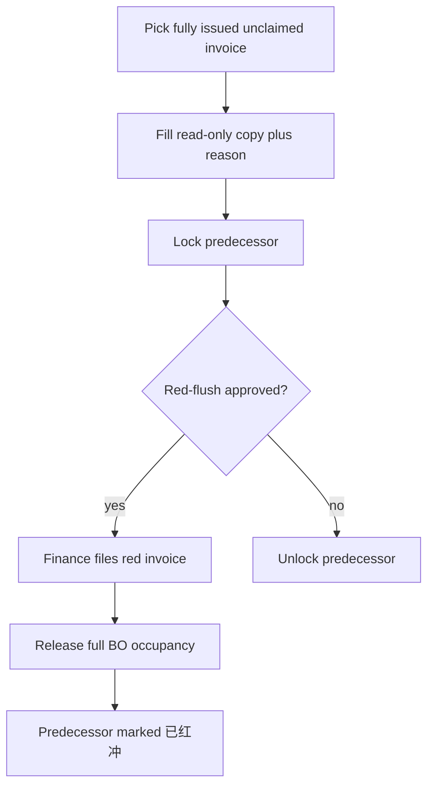
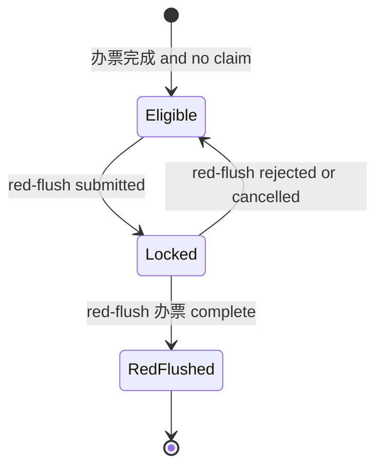
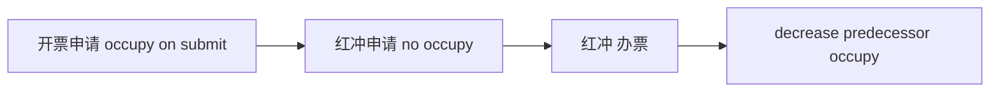

# Invoice Red-Flush Application - Plan

## Goal Capsule

- **Objective:** A business applicant can reverse one fully issued, unclaimed invoice so that after the red invoice is filed, that invoice no longer occupies business-order openable balance and cannot be claimed or red-flushed again.
- **Means:** Sibling 开票申请-红冲 application, cloned from 开票申请, predecessor is the original invoice (KTD1).
- **Product authority:** This plan owns only 开票申请-红冲. Other items from the same request (detail 404s, proxy-ticket print, seal-menu icon, historical import, 无票可见性) are surrounding work, not active scope.
- **Stop when:** AE1–AE7 pass in service tests, the starter can open the form from the 财务 menu, and 办票 on a red-flush releases the predecessor occupy without changing 开票申请's own occupy-on-submit path.
- **Open blockers:** None.
- **Product Contract preservation:** unchanged.

---

## Product Contract

### Summary

Add an independent 开票申请-红冲 process for business staff.
They pick one fully issued, unclaimed 开票申请, get a read-only full copy of that form, click through to the original, follow the same approval and 办票 path as 开票申请, and only then release the original invoice's business-order occupancy in full.

### Problem Frame

Finance can void occupancy, but they do not know which issued invoice should be reversed.
Only the business applicant knows which ticket needs a red invoice.
Today there is no business-initiated red-flush application, so occupancy stays on the business order until someone cancels outside this product.

### Key Decisions

- Independent red-flush application, not a void button and not a blue/red type on 开票申请. Governs R3, R6.
- Full-amount red-flush only `(session-settled: user-directed — chosen over 部分红冲 / 默认可改小: 贴合整单回填，一张原单只红一次)`. Governs R3, R7.
- Claimed invoices cannot be red-flushed `(session-settled: user-directed — chosen over 连带作废认领 / 认领不动: 先解开认领再红冲)`. Governs R1.
- Only 办票完成 invoices are eligible `(session-settled: user-directed — chosen over 部分开票 / 审批通过即可: 未开票走原撤销)`. Governs R1.
- Release occupancy after red-flush 办票 completes `(session-settled: user-directed — chosen over 审批通过即回退: 红字票未出不能再开蓝票)`. Governs R7.
- Same initiator, approval chain, and 办票 roles as 开票申请 `(session-settled: user-directed — chosen over 仅财务发起 / 财务短链: 哪张要作废只有业务知道)`. Governs R6, R9.

### Requirements

**Eligibility and lock**

- R1. A red-flush predecessor must be a 开票申请 that is 办票完成, not voided, not already red-flushed, has no pending or confirmed 到款认领, and has no in-progress red-flush.
- R2. Submitting a red-flush locks that predecessor so no second red-flush can select it. Reject or cancel of the red-flush unlocks the predecessor and does not change its business-order occupancy.

**Form and predecessor**

- R3. The create/view form matches 开票申请 except the predecessor control is a 开票申请 picker. Selecting a predecessor fills every corresponding field from that invoice. Amounts and buyer/tax snapshots stay read-only.
- R4. In create and view, the selected 开票申请 is clickable and opens that invoice's form content.
- R5. 红冲原因 is required. 特殊情况说明 stays optional.

**Approval, 办票, occupancy**

- R6. Who may start, who approves, and who files 办票 attachments is the same role split as 开票申请.
- R7. Completing red-flush 办票 releases the predecessor invoice's business-order occupancy by the predecessor's full occupied amount. Approval alone does not release it.
- R8. After that 办票, the predecessor is 已红冲: it cannot be selected again, cannot accept new 到款认领, and its business orders become openable again by that released amount.

**Placement**

- R9. The application has its own menu entry next to 开票申请, visible to the same starter and finance roles as 开票申请.

### Actors

- A1. Business applicant: starts and resubmits 红冲. Same start right as 开票申请.
- A2. Approvers: same chain as 开票申请.
- A3. Finance issuer: files the red invoice on the red-flush, not on the original.

### Key Flows

- F1. Happy path
  - **Trigger:** A1 needs to reverse one issued invoice.
  - **Actors:** A1, A2, A3
  - **Steps:** A1 picks an eligible invoice, reviews the filled form, clicks through to confirm, enters 红冲原因, submits. A2 approves. A3 completes 办票. Occupancy releases. Predecessor becomes 已红冲.
  - **Covered by:** R1, R3, R4, R5, R6, R7, R8
- F2. Ineligible predecessor
  - **Trigger:** A1 opens the predecessor picker.
  - **Steps:** Invoices that are not 办票完成, have claims, are already 已红冲, or are locked by another red-flush do not appear.
  - **Covered by:** R1, R2
- F3. Reject or withdraw
  - **Trigger:** A2 rejects or A1 withdraws before 办票.
  - **Steps:** Predecessor unlocks. Original occupancy stays. A1 may start again on the same invoice.
  - **Covered by:** R2, R7

### Acceptance Examples

- AE1. Eligible pick
  - **Covers R1.**
  - **Given:** Invoice I is 办票完成, unclaimed, not 已红冲.
  - **When:** A1 opens the predecessor picker.
  - **Then:** I is selectable.
- AE2. Claimed invoice hidden
  - **Covers R1.**
  - **Given:** Invoice I has pending or confirmed 到款认领.
  - **When:** A1 opens the predecessor picker.
  - **Then:** I is not selectable.
- AE3. Read-only fill
  - **Covers R3.**
  - **Given:** A1 selects I.
  - **When:** The form fills.
  - **Then:** Amounts equal I's amounts and cannot be edited.
- AE4. Click-through
  - **Covers R4.**
  - **Given:** A predecessor is selected.
  - **When:** A1 or an approver clicks it.
  - **Then:** They see I's 开票申请 form content.
- AE5. Occupy stays through approval
  - **Covers R7.**
  - **Given:** A red-flush on I is approved but not 办票完成.
  - **When:** Someone checks I's business orders.
  - **Then:** Occupancy from I is unchanged.
- AE6. Occupy released after 办票
  - **Covers R7, R8.**
  - **Given:** A3 completes 办票 on the red-flush.
  - **When:** Occupancy is recomputed.
  - **Then:** Each business order on I is released by I's full occupied amount, I is 已红冲, and those orders can be invoiced again.
- AE7. Dual submit blocked
  - **Covers R2.**
  - **Given:** A red-flush on I is in progress.
  - **When:** Another applicant opens the picker.
  - **Then:** I is not selectable.

### Scope Boundaries

- Partial red-flush, amount edits, and multiple red-flushes against one invoice.
- Red-flush of unissued or partially issued invoices.
- Red-flush of claimed invoices, or auto-voiding those claims.
- Releasing occupancy on red-flush approval rather than 办票.
- Finance-only initiation, or a void control on the original invoice with no new application.
- 收款回单 on the 722 红冲 sheet.
- Deducting red-flush from 毛利表 in this slice.
- Surrounding request items: salary/tax detail 404, payment preview 404, 报销代票 print, 用印 menu icon, historical import, 无票可见性.

<!-- ce-section: work-relationships -->
### How This Work Fits Together

This plan owns 开票申请-红冲 only.
The rest of the 2026-08-24 request is the current surrounding understanding, not a roadmap.

- Approval detail / preview 404 (薪资付款、税金付款、付款申请)
  - Can proceed independently of this plan
- 报销代票 print (hide 是否代票, single page)
  - Can proceed independently of this plan
- 用印申请 missing secondary-menu icon
  - Can proceed independently of this plan
- 开票申请 and 商务单 historical import
  - Can proceed independently of this plan
  - Shares invoice and business-order masters with red-flush occupancy
- 无票申请 role visibility
  - Can proceed independently of this plan

### Dependencies / Assumptions

- 开票申请 already occupies on submit, keeps occupy on approve, and releases on reject/cancel. Red-flush must not reuse reject/cancel as its complete path.
- 到款认领 hangs on the invoice. Picker hide is not enough: create/resubmit must re-check R1, and claimAllowed must deny lock/已红冲.
- After release, 可开余额 = 结算 − remaining occupy, so a later 开票申请 can use the freed amount.
- `OA表单-722.md` 红冲 sheet is the field source except amount is not editable (R3).

### Outstanding Questions

- None blocking.
- Former planning forks resolved in KTD1–KTD4.

### Sources / Research

- `OA表单-722.md` sheet 红冲发票申请 (predecessor = 开票ID; 722 allows editable amount — overridden by R3).
- `docs/superpowers/specs/2026-07-22-finance-management-design.md` (associate prior issued invoice; release openable balance after confirmed red-flush; 722-era partial amount not adopted).
- `docs/superpowers/specs/2026-07-29-finance-invoice-bpm-delegate.md` and `docs/superpowers/specs/2026-07-29-finance-invoice-claim-field-contract.md` (occupy on submit; claimAllowed ignores issue status; 红冲 was a T1 non-goal).

---

## Planning Contract

### Key Technical Decisions

- KTD1. Sibling application, not a type on 开票申请. New ledger like 薪资/税金相对付款；发起通道跟开票申请一样走 create-shell embed，不要做成薪税那种目录跳转。Mixing blue/red on one record would re-enter occupy-on-submit and claimAllowed. Governs R3, R6, R9.
- KTD2. Red-flush create/start must not increase business-order occupy. Only the predecessor's occupy exists until red-flush 办票 releases it. Governs R7, AE5.
- KTD3. Predecessor lock is exclusive state on the original 开票申请, written in the same transaction as red-flush start, cleared on reject/cancel. Picker and claimAllowed both honor 已红冲 and in-progress lock. Governs R1, R2, R8, AE7.
- KTD4. Click-through opens a stacked overlay of the existing 开票申请 info view so the create form stays mounted. Governs R4, AE4.
- KTD5. This slice includes process-model publish, form view path, menu, and the same role grants as 开票申请. Code without publish cannot be started. Governs R6, R9.
- KTD6. Process key is `finance_invoice_redflush_apply`. Use that token in start, embed-registry, BPMN, and form view path.

### High-Level Technical Design

Red-flush is a second ledger row pointing at one 开票申请.
It never writes `invoiced_occupied_amount` on create.
`completeIssue` on the red-flush is the only release of the predecessor's occupy.

### Assumptions

- Goal-driven plan write accepted the sibling-application shape and in-slice publish without a live confirm.
- 开票申请 occupy/release helpers can be reused for the predecessor release; the 开票申请 create path stays untouched.
- BPMN can follow the 开票申请 approval diagram with a new process key.

### Sequencing

U1 then U2 then U3.
U4 can start after U1 picker contract exists.
U5 can start after the process key in U2 is fixed.
Do not land U4/U5 as the only shipped slice: occupy rules live in U2/U3.

---

## Implementation Units

### U1. Predecessor eligibility and lock storage

- **Goal:** Persist red-flush rows and decide which 开票申请 may be picked.
- **Requirements:** R1, R2, R5
- **Dependencies:** none
- **Files:**
  - `sql/mysql/` new idempotent DDL for the red-flush ledger, predecessor lock / 已红冲 on 开票申请, and 红冲原因
  - `yudao-module-finance/yudao-module-finance-server/src/main/java/cn/iocoder/yudao/module/finance/` new red-flush DO/mapper plus invoice mapper updates
  - `yudao-module-finance/yudao-module-finance-server/src/test/java/cn/iocoder/yudao/module/finance/service/invoice/` new picker/lock tests
- **Approach:**
  1. Add a sibling ledger with a required predecessor invoice id and required 红冲原因.
  2. Add exclusive lock and 已红冲 on the predecessor so two in-flight red-flushes cannot share one invoice.
  3. Expose a selectable-predecessor query: 办票完成, not voided, no pending/confirmed claim, not locked, not 已红冲.
- **Execution note:** Implement new domain behavior test-first.
- **Patterns to follow:** `FinanceInvoiceApplicationServiceImpl` occupy CAS; `FinanceReceiptClaimServiceImpl.isClaimAllowed` for the claim hide rule (do not reuse claimAllowed as the red-flush allow rule — it ignores issue status).
- **Test scenarios:**
  - Covers AE1. Fully issued, unclaimed, unlocked invoice appears in the picker.
  - Covers AE2. Invoice with pending or confirmed claim does not appear.
  - Approved but not 办票完成 invoice does not appear.
  - Already 已红冲 invoice does not appear.
  - Locked invoice does not appear.
- **Verification:** Picker tests fail closed on every R1 exclusion.

### U2. Create, start, resubmit, and unlock

- **Goal:** Business staff can start and resubmit a red-flush without changing business-order occupy.
- **Requirements:** R2, R3, R5, R6
- **Dependencies:** U1
- **Files:**
  - `yudao-module-finance/yudao-module-finance-server/src/main/java/cn/iocoder/yudao/module/finance/service/` red-flush service
  - `yudao-module-finance/yudao-module-finance-server/src/main/java/cn/iocoder/yudao/module/finance/controller/admin/` red-flush controller
  - `yudao-module-finance/yudao-module-finance-server/src/main/java/cn/iocoder/yudao/module/finance/framework/bpm/` approval outcome listener/delegate clone
  - `yudao-module-bpm/yudao-module-bpm-server/src/main/java/cn/iocoder/yudao/module/bpm/service/definition/BpmEmbedProcessStartPermissionRegistry.java`
  - matching service tests under `yudao-module-finance/yudao-module-finance-server/src/test/java/cn/iocoder/yudao/module/finance/`
- **Approach:**
  1. createAndStart and resubmit re-validate the full R1 set in the same transaction as the lock CAS. A client-sent claimed, unissued, voided, 已红冲, or locked predecessor is rejected. Then snapshot read-only amounts and buyer/tax, store 红冲原因, lock, start BPM.
  2. Do not call increase-occupy (KTD2).
  3. Reject/cancel unlocks the predecessor only. Do not call releaseAllOccupyForApplication on the red-flush or the predecessor. Occupy release stays in U3.
  4. Resubmit re-validates eligibility if the lock was cleared.
  5. Terminal outcomes are written only by the Flowable delegate/listener. Do not add an HTTP on-approval-outcome.
- **Execution note:** Implement new domain behavior test-first.
- **Patterns to follow:** `FinanceInvoiceApplicationServiceImpl.createAndStart` / `resubmit` / `onApprovalOutcome`, without the occupy-increase branch. `finance_salary_payment_apply` as the sibling-process registration pattern.
- **Test scenarios:**
  - Create copies predecessor amounts and refuses a client-sent different amount.
  - Create does not change any business-order occupy.
  - Concurrent second create on the same predecessor fails and does not start a second process.
  - Reject unlocks the predecessor and occupy stays.
  - Cancel/withdraw unlocks and occupy stays.
  - Missing 红冲原因 is rejected.
- **Verification:** Occupy totals before/after create and after reject are identical.

### U3. Red-flush 办票 releases predecessor occupy

- **Goal:** Filing the red invoice completes the red-flush and frees the original occupy.
- **Requirements:** R7, R8
- **Dependencies:** U2
- **Files:**
  - red-flush `completeIssue` on the same service/controller cluster as U2
  - `FinanceReceiptClaimServiceImpl` claimAllowed path so 已红冲 invoices cannot be claimed
  - `yudao-module-finance/yudao-module-finance-server/src/test/java/cn/iocoder/yudao/module/finance/service/invoice/` and claim tests
- **Approach:**
  1. completeIssue is allowed only when the red-flush is approved and not voided.
  2. On success, release the predecessor's occupy by its full occupied amount, mark predecessor 已红冲, clear the in-progress lock.
  3. Approval of the red-flush must not release occupy (AE5).
  4. claimAllowed / claim create must reject 已红冲 predecessors and predecessors locked by an in-progress red-flush. Today's claimAllowed ignores issue status, so this is a required contract change, not a picker-only filter.
- **Execution note:** Implement new domain behavior test-first.
- **Patterns to follow:** `FinanceInvoiceApplicationServiceImpl.completeIssue` and `releaseAllOccupyForApplication`, aimed at the predecessor, not the red-flush row.
- **Test scenarios:**
  - Covers AE5. After red-flush approval, predecessor occupy is unchanged.
  - Covers AE6. After red-flush 办票, each predecessor line's business order decreases by that invoice's occupy and a new 开票申请 can use the freed amount.
  - 办票 on a still-pending red-flush is rejected.
  - Second 办票 is idempotent and does not double-release.
  - New claim against a 已红冲 invoice is rejected.
  - New claim against an invoice locked by an in-progress red-flush is rejected.
- **Verification:** One happy-path test shows occupy before 办票 equals the original invoice, and after 办票 equals original minus that invoice.

### U4. Form, click-through, list, and BPM view

- **Goal:** Applicants and approvers use a form that matches 开票申请 with a predecessor picker.
- **Requirements:** R3, R4, R5, R6, R9
- **Dependencies:** U1
- **Files:**
  - `ruoyi-office-vben/apps/web-antd/src/views/finance/` new red-flush list, form-body, info view
  - `ruoyi-office-vben/apps/web-antd/src/api/finance/` red-flush API
  - `ruoyi-office-vben/apps/web-antd/src/views/bpm/processInstance/create/embed-registry.ts`
  - reuse `ruoyi-office-vben/apps/web-antd/src/views/finance/invoice-application/modules/info.vue` for click-through
- **Approach:**
  1. One header-level 开票申请 picker. Copy predecessor lines into a read-only table; do not put a predecessor select on each line.
  2. After fill, every copied field is read-only. Only 红冲原因 and 特殊情况说明 are writable.
  3. Predecessor click opens a stacked overlay with `invoice-application/modules/info.vue` so the create form stays mounted.
  4. Register `finance_invoice_redflush_apply` in the create-shell embed registry so submit goes through the business API.
- **Patterns to follow:** `invoice-application/modules/form-body.vue`, `embed-registry.ts` `finance_invoice_apply` entry, invoice info modal.
- **Test scenarios:**
  - Covers AE3. Selecting a predecessor fills matching amounts and they cannot be edited.
  - Covers AE4. Clicking the predecessor shows that invoice's form content.
  - Submit without 红冲原因 is blocked in the form.
- **Verification:** Create shell opens the red-flush form for the new process key; click-through shows the original invoice, not the red-flush.

### U5. Menu, roles, and process publish

- **Goal:** The same people who start and issue 开票申请 can start and issue 红冲, and the process is startable in the environment.
- **Requirements:** R6, R9
- **Dependencies:** U2
- **Files:**
  - `sql/mysql/` idempotent menu/permission/role-grant SQL under 财务, next to 开票申请
  - `sql/mysql/` BPM form view path for the new process key
  - BPMN definition cloned from 开票申请 with the new process key
- **Approach:**
  1. Page menu plus create/query/resubmit/issue buttons.
  2. `business_staff` gets query/create/resubmit; `finance_admin` gets query/issue/update.
  3. Publish form view path and the process model (KTD5). The BPMN must bind the U2 red-flush outcome handler and use the red-flush id as businessKey, not the invoice occupy-release delegate.
- **Patterns to follow:** `sql/mysql/finance_invoice_application_menu_phase2b.sql`, `sql/mysql/finance_invoice_bpm_form_view_path.sql`, `sql/mysql/finance_menu_group_20260821.sql` 财务 group.
- **Test scenarios:**
  - Test expectation: none for UI layout — role SQL is reviewed by idempotent apply and a start-permission registry test that the new key requires the create permission.
- **Verification:** After SQL/model apply, a business_staff user sees the menu and can start; a finance-only issuer cannot start.

---

## Verification Contract

- Finance server tests for U1–U3 and claim rejection of 已红冲, in `yudao-module-finance/yudao-module-finance-server`, using the same Surefire class filter style as `docs/superpowers/specs/2026-07-29-finance-invoice-claim-regression.md`.
- Existing `FinanceInvoiceApplicationServiceImplTest` must still pass: 开票申请 occupy-on-submit is unchanged.
- U4 is verified by walking create → click-through → submit on the 财务 menu after U5 publish.
- Do not treat 开票申请 reject/cancel release tests as coverage for red-flush complete.

---

## Definition of Done

- Global: a business applicant can start 开票申请-红冲 from the 财务 menu, lock one eligible invoice, and after finance 办票 the predecessor occupy is gone and that invoice cannot be claimed or red-flushed again.
- U1: picker exclusions match R1.
- U2: create does not occupy; reject/cancel unlocks only.
- U3: 办票 is the sole release; AE5 and AE6 hold.
- U4: form is a read-only fill with click-through to the original invoice.
- U5: menu, roles, and process publish exist; abandoned experiment code is not left in the diff.
