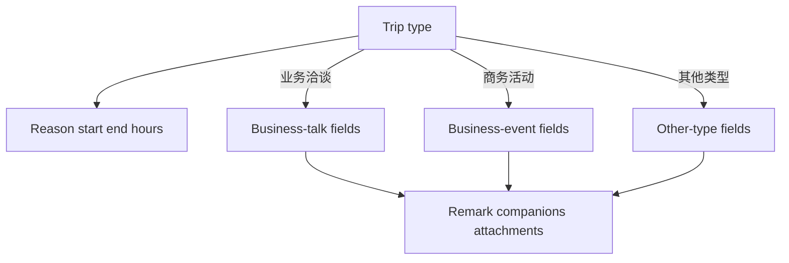
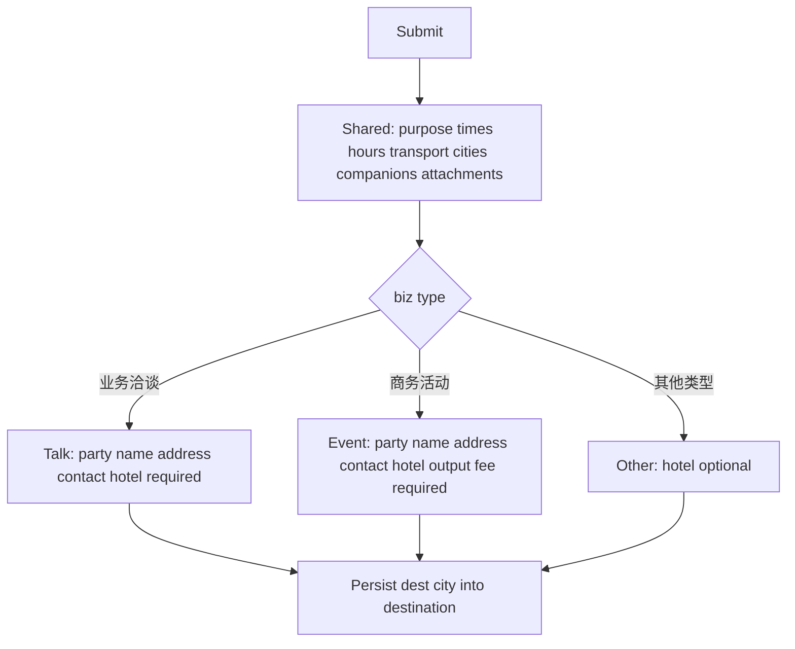
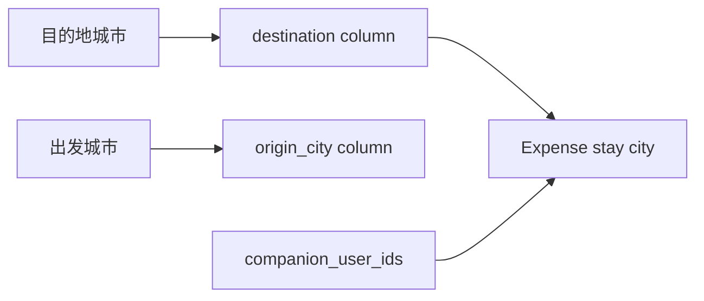

# OA Trip Apply Form - Plan

## Goal Capsule

- **Objective:** 员工发起出差时按类型填完整行程信息，审批人能看到这些字段；费用报销仍能拿到一个目的地城市和组织内同行人来套住宿标准。
- **Means:** 在现有 `bpm_oa_business_trip` 单行上扩展字段，用新业务类型切换单段明细；时长/附件复用外出申请模式 (KTD1, KTD3)。
- **Product authority:** 本计划只覆盖出差申请及其在审批/详情中的展示。外出申请、多段行程、按多目的地拆报销不是当前范围。
- **Stop conditions:** 改报销住宿公式、改外出申请、加多条明细、改 BPM 选人。
- **Open blockers:** 无。
- **Execution profile:** 后端类型条件校验先写失败测试；前端以统一发起 embed 为准，并堵住列表发起/重提旧页。
- **Tail ownership:** 幂等 SQL 种子随代码提交；发布时执行该 SQL。

---

## Product Contract

### Summary

把现有出差申请从「城市 + 日期 + 原因 + 同行人」改成钉钉同构的类型化单段表单：业务洽谈 / 商务活动 / 其他类型决定字段，一张单只有一个目的地。

### Problem Frame

现有出差单不够业务审批用：没有类型、交通、机酒和对接对象。钉钉已在用那套字段。多段明细会迫使报销按城拆住宿，这轮不接。

### Key Decisions

- **Keep OA companion and city widgets** (session-settled: user-directed — chosen over DingTalk free-text companion and city: reimbursement stay calculation keeps working). Governs R8, R15, R17.
- **Single-leg one destination** (session-settled: user-directed — chosen over repeating details and per-destination hotel caps: one form one destination city). Governs R2, R17.
- **One process with a type switch** over three catalog entries. Governs R1, R3.
- **Datetime plus auto hours** over the current date-only range. Governs R5, R6.
- **Existing BPM assignees** over DingTalk's visible approver picker. Governs R18.

### Actors

- A1. Applicant: starts the trip process from the unified catalog.
- A2. Approver: reads submitted fields on the task.

### Requirements

**Type and single detail**

- R1. 出差类型必填，选项仅为业务洽谈、商务活动、其他类型。
- R2. 一张单只有一段明细、一个出发城市、一个目的地城市。没有添加、复制、删除明细。
- R3. 切换类型时只展示该类型字段；未选类型的字段不提交。

**Header**

- R4. 出差事由必填。
- R5. 开始时间和结束时间必填，精确到时分；结束必须晚于开始。
- R6. 出差时长由起止时间自动计算并展示为小时，提交前必须大于 0。申请人不能手改时长。

**Type-specific fields**

- R7. 三种类型都要交通工具、出发城市、目的地城市，三者必填。交通工具选项为飞机、火车、汽车、自驾。
- R8. 出发城市和目的地城市使用现有差旅城市字典控件，不能手填。
- R9. 业务洽谈另需必填：业务公司全称、业务公司具体地址、对接人姓名职务联系方式、机酒预定情况。地址与对接人为文本。
- R10. 商务活动另需必填：活动邀请方、活动举办详细地址、对接人姓名职务联系方式、机酒预定情况、是否需要内容产出、是否有车马费。地址与对接人为文本。
- R11. 其他类型不收集公司、活动、产出、车马费；机酒预定情况选填。
- R12. 机酒预定情况选项固定为：对方包机酒；对方包交通费，酒店自行预定报销；对方包酒店，交通费自行预定报销；对方不包机酒，自行预定报销。
- R13. 是否需要内容产出、是否有车马费为是否二选一。

**Footer, reimbursement, and display**

- R14. 备注选填。
- R15. 同行人使用现有组织内多选，至少一人，不能包含申请人自己。
- R16. 附件必填，提示为出差对接、机酒预定信息。
- R17. 提交后费用报销仍用这一颗目的地城市和同行人名单套住宿标准。本轮不改报销计算规则。
- R18. 审批人与抄送仍走现有出差 BPM。表单不提供钉钉式审批人编辑。
- R19. 发起、待办、已办、详情都展示已填的新字段。历史只有地点、原因、同行人的旧单仍可读，缺的新字段按空展示。

### Key Flows

- F1. Start a trip
  - **Trigger:** A1 opens 出差申请.
  - **Actors:** A1
  - **Steps:** Choose type, fill header and the matching detail, add required companions and attachments, submit.
  - **Outcome:** One trip instance with one destination city.
  - **Covered by:** R1, R2, R4, R5, R6, R15, R16
- F2. Switch type before submit
  - **Trigger:** A1 changes 出差类型.
  - **Actors:** A1
  - **Steps:** Visible detail fields replace with the new type. Previous type values are not submitted.
  - **Covered by:** R3, R9, R10, R11
- F3. Approve
  - **Trigger:** A2 opens the task.
  - **Actors:** A2
  - **Steps:** Read type-specific fields, companions, attachments, and duration. Assignees stay as the process already defines.
  - **Covered by:** R18, R19

### Acceptance Examples

- AE1. Business-talk required set
  - **Covers R1, R7, R9, R12.**
  - **Given:** type is 业务洽谈.
  - **When:** A1 omits 机酒预定情况 or 业务公司全称.
  - **Then:** submit is rejected.
- AE2. Other-type hotel optional
  - **Covers R11.**
  - **Given:** type is 其他类型.
  - **When:** A1 fills transport and cities but skips 机酒预定情况.
  - **Then:** submit succeeds if header, companions, and attachments are valid.
- AE3. No second destination
  - **Covers R2.**
  - **Given:** the apply form is open.
  - **When:** A1 looks for 添加明细 or a second 目的地城市.
  - **Then:** those controls are absent.
- AE4. Reimbursement still one city
  - **Covers R8, R15, R17.**
  - **Given:** a submitted trip with 目的地城市 Shanghai and two org companions.
  - **When:** expense stay calculation runs.
  - **Then:** it uses Shanghai and those companions, with no per-leg split.
- AE5. History remains readable
  - **Covers R19.**
  - **Given:** an older trip that only stored destination, reason, and companions.
  - **When:** A2 opens detail.
  - **Then:** those fields show; type-specific fields are empty, not an error.

### Scope Boundaries

- 外出申请不改。
- 不提供添加、复制、删除多条明细。
- 同行人不改成手填，城市不改成手填。
- 不按多个目的地分别套住宿标准。
- 不在表单上复制钉钉的审批人、抄送人编辑 UI。

### Deferred to Follow-Up Work

- 列表发起/重提若仍走独立 create 页，本计划会把它接到同一套表单；不另开草稿、打印、行程重叠校验、往返多交通。

<!-- ce-section: work-relationships -->
### How This Work Fits Together

本计划只拥有出差申请表单。外出申请是并列假勤流程，可独立进行，不是本计划范围。

- 费用报销住宿标准：Depends on 本计划继续提供一个目的地城市和组织内同行人。Shares R17。Can proceed independently of 新类型字段展示。
- 外出申请：Can proceed independently of 本计划。

### Dependencies / Assumptions

- 差旅城市字典和组织选人控件已存在，本轮复用。
- 现有出差 BPM 审批链保持，不因字段增加而改选人规则。
- 时长算法与外出申请同类：由起止时分算出小时。
- 发起壳若已展示申请人、部门、任职公司，embed 表单不再重复这些身份字段。

### Sources / Research

- 用户提供的钉钉出差截图：类型、单段字段、交通与机酒选项、附件必填。
- 现有出差申请为日期范围 + 差旅城市 + 必填组织同行人；报销按 `destination` 与同行人算住宿。
- 外出申请已有时分起止、自动时长、可选产出与附件，作为时长和附件的行为参照，不是本轮改动对象。
- 8/18 出差设计里的「市内/省内」类型和「不注册 embed」已过时；以当前代码与本 Product Contract 为准。

---

## Planning Contract

Product Contract preservation: restructured, no scope change: Outstanding Questions resolved into KTD1–KTD7; R/A/F/AE IDs unchanged.

### Key Technical Decisions

- KTD1. **New biz-type column and dict, do not reuse `type` 1–4** (session-settled: user-approved — chosen over overwriting 市内/省内/省外/国外: old rows would mislabel as 业务洽谈). Governs R1, R19. New dict `bpm_oa_trip_biz_type` values 1/2/3 = 业务洽谈/商务活动/其他类型. Legacy `type` stays nullable and unused on new creates.
- KTD2. **`destination` remains the dest-city dict value.** Origin city is a new column. Expense and picker labels keep reading `destination`. Governs R8, R17.
- KTD3. **Typed columns plus outing-style JSON attachments.** Companions stay comma `companion_user_ids`. 机酒 is a four-value dict, not a boolean. 产出/车马费 reuse `infra_boolean_string`. Governs R7, R12, R13, R16.
- KTD4. **Canonical apply is embed `form-body.vue`.** List 发起/重提 must use the same body, not the stale standalone schema. Governs R19, F1.
- KTD5. **Type switch keeps shared fields** (交通、出发、目的地、仍可见的机酒/对接人). Clears fields the new type does not have. Governs R3, F2.
- KTD6. **Required attachments allow 对接材料.** Do not require booked tickets. Apply-before-book is allowed. Governs R16.
- KTD7. **No finance or BPMN change.** Ignore `startUserSelectAssignees`. Do not put new biz type into process var `type`. Governs R17, R18.

### High-Level Technical Design

洽谈的公司全称与活动的邀请方共用 `party_name`；具体地址共用 `address`；对接人共用 `contact_info`。UI 按类型换标签。其他类型这些列为 null。

### Assumptions

- 出发城市可与目的地相同。
- 日期控件与外出一致：`YYYY-MM-DD HH:mm`，不含秒。
- 旧单详情展示已存 `hours`，不按 00:00–23:59 重算。
- 无业务类型的旧单：新字段缺省则隐藏，避免空白墙；有业务类型的新单按 R19 展示空值。
- FileUpload 上限与外出相同：最多 10 个、20MB。
- 驳回重提仍走新建；尽量带出业务字段和仍有效的附件 URL。
- 列表列：类型、事由、目的地、时长、状态、日期。筛选用新业务类型。

### Sequencing

U1 schema → U2 create API → U3 embed form → U4 list/detail/resubmit.

### Risks

- 只改 embed 会留下列表发起/重提走旧 `create.vue`。Mitigation: KTD4 / U4.
- 复用 `type` 1–4 会把旧市内显示成业务洽谈。Mitigation: KTD1.
- 目的地若只写入新列，报销住宿会断。Mitigation: KTD2.

---

## Implementation Units

### U1. Schema and dictionaries

- **Goal:** Add additive columns and new dicts without rewriting historical `type` 1–4.
- **Requirements:** R1, R7, R8, R12, R13, R16, R17
- **Dependencies:** none
- **Files:**
  - `sql/mysql/bpm_oa_trip_biz_fields.sql` (create)
  - `ruoyi-office-vben/packages/constants/src/dict-enum.ts`
- **Approach:**
  1. Idempotent ALTER for origin city, biz type, transport, hotel booking, party name, address, contact, need output, carriage fee, remark, attachment URLs JSON.
  2. Seed `bpm_oa_trip_biz_type`, `bpm_oa_trip_transport`, `bpm_oa_trip_hotel_booking`. Do not change `bpm_oa_trip_type` data.
  3. Keep `destination` and `companion_user_ids` as they are.
- **Patterns to follow:** `sql/mysql/bpm_oa_trip_destination_companion.sql`, outing `attachment_urls` JSON.
- **Test scenarios:**
  - Happy path: re-running the SQL does not fail and does not duplicate dict rows.
  - Edge: table already has `destination`; script does not drop it.
- **Verification:** SQL applies on a DB that already has `bpm_oa_business_trip`. New dict types appear in admin dict UI after seed.

### U2. Create validation and persistence

- **Goal:** Server rejects incomplete type-specific payloads and always stores dest city in `destination`.
- **Requirements:** R1–R17, AE1, AE2, AE4. Cites KTD1, KTD2, KTD3, KTD6, KTD7.
- **Dependencies:** U1
- **Files:**
  - `yudao-module-bpm/yudao-module-bpm-server/src/main/java/cn/iocoder/yudao/module/bpm/dal/dataobject/oa/BpmOATripDO.java`
  - `yudao-module-bpm/yudao-module-bpm-server/src/main/java/cn/iocoder/yudao/module/bpm/controller/admin/oa/vo/BpmOATripCreateReqVO.java`
  - `yudao-module-bpm/yudao-module-bpm-server/src/main/java/cn/iocoder/yudao/module/bpm/controller/admin/oa/vo/BpmOATripRespVO.java`
  - `yudao-module-bpm/yudao-module-bpm-server/src/main/java/cn/iocoder/yudao/module/bpm/service/oa/BpmOATripServiceImpl.java`
  - `yudao-module-bpm/yudao-module-bpm-api/src/main/java/cn/iocoder/yudao/module/bpm/enums/ErrorCodeConstants.java`
  - `yudao-module-bpm/yudao-module-bpm-server/src/test/java/cn/iocoder/yudao/module/bpm/service/oa/BpmOATripServiceTest.java`
  - `ruoyi-office-vben/apps/web-antd/src/api/bpm/oa/trip/index.ts`
- **Approach:**
  1. Map dest city into existing `destination`. Leave legacy `type` null on new rows.
  2. Validate by biz type per R9–R11. Attachments length ≥ 1. Hours still from `OaDurationHours`.
  3. Null out fields the selected type does not own before insert.
  4. Process vars stay `hours`, `destination`, optional `startCompanyDeptId`. Do not write new biz type into var `type`.
  5. Keep ignoring start-user assignees.
- **Execution note:** Extend `BpmOATripServiceTest` first with failing create cases, then implement.
- **Patterns to follow:** `BpmOAOutingServiceImpl` attachments and `needOutput`; existing companion checks.
- **Test scenarios:**
  - Covers AE1. 业务洽谈 missing hotel or party name → `OA_TRIP_FIELD_REQUIRED`.
  - Covers AE2. 其他类型 without hotel, with attachments and companions → create succeeds.
  - Covers AE4. Origin 广州 dest 上海 → persisted `destination` is 上海; process var `destination` is 上海.
  - Missing attachments → rejected.
  - Companion is applicant → `OA_TRIP_COMPANION_INVALID`.
  - Assignees map still ignored.
  - Hours 90 minutes → 1.5.
- **Verification:** `BpmOATripServiceTest` covers the cases above.

### U3. Catalog embed form

- **Goal:** Unified start form matches the type-conditional single-leg UI.
- **Requirements:** R1–R16, AE1–AE3, F1, F2. Cites KTD3, KTD4, KTD5, KTD6.
- **Dependencies:** U2
- **Files:**
  - `ruoyi-office-vben/apps/web-antd/src/views/bpm/oa/trip/modules/form-body.vue`
  - `ruoyi-office-vben/apps/web-antd/src/views/bpm/oa/trip/data.ts`
- **Approach:**
  1. RangePicker with time like outing. Disabled hours via `calcTripHours`.
  2. Biz-type select. `v-if` sections. No add/copy/delete.
  3. Cities use `OA_TRAVEL_CITY`. Companions stay org multi-select.
  4. FileUpload required, help text per R16.
  5. Embed does not repeat 申请人/部门. Keep `reset/submit/getPredictVariables`. Predict `destination` and `hours`.
- **Patterns to follow:** `outing/modules/form-body.vue`.
- **Test scenarios:**
  - Covers AE3. No control to add a second dest city.
  - Switching 洽谈 → 其他 clears party name and does not submit it.
  - Switching 洽谈 → 商务活动 keeps cities and transport.
  - Empty attachment list blocks submit.
- **Verification:** Catalog start 出差申请 shows the new fields. `BpmOATripOutingMenuContractTest` still points embed at `form-body.vue`.

### U4. Detail, list, and resubmit

- **Goal:** Todo/done/detail and list 发起/重提 show or edit the same new fields.
- **Requirements:** R19, F3, AE5. Cites KTD1, KTD4.
- **Dependencies:** U3
- **Files:**
  - `ruoyi-office-vben/apps/web-antd/src/views/bpm/oa/trip/create.vue`
  - `ruoyi-office-vben/apps/web-antd/src/views/bpm/oa/trip/detail.vue`
  - `ruoyi-office-vben/apps/web-antd/src/views/bpm/oa/trip/index.vue`
  - `ruoyi-office-vben/apps/web-antd/src/views/bpm/oa/trip/data.ts`
  - `yudao-module-bpm/yudao-module-bpm-server/src/main/java/cn/iocoder/yudao/module/bpm/controller/admin/oa/vo/BpmOATripPageReqVO.java`
- **Approach:**
  1. Standalone create wraps or delegates to `form-body` so list 发起/重提 cannot post the old type-only payload.
  2. Detail shows new fields with DictTag and attachment preview. Legacy rows without biz type hide empty type-specific blocks.
  3. List columns: biz type, reason, destination, hours, status, dates. Filter uses new biz-type dict.
  4. Resubmit prefills via create-new, not update API.
- **Patterns to follow:** outing detail datetime + attachments; current trip controller nickname join.
- **Test scenarios:**
  - Covers AE5. Get of a row with only destination/reason/companions returns without error; new fields null.
  - List filter by 业务洽谈 does not return a historical 市内 row stored as `type=1`.
  - Resubmit of a rejected new-schema bill opens the new form with dest city and companions filled.
- **Verification:** Opening `/bpm/oa/trip/detail` from a todo task shows the submitted type-specific fields. List 发起出差 no longer asks 市内/省内.

---

## Verification Contract

- Trip create/access: `mvn -pl yudao-module-bpm/yudao-module-bpm-server -Dtest=BpmOATripServiceTest,BpmOATripOutingMenuContractTest test`
- Expense stay still keyed by destination: `mvn -pl yudao-module-finance/yudao-module-finance-server -Dtest=FinanceExpenseStayStandardTest,FinanceStayCityCapsTest test`
- Manual: unified start 出差申请 for each of the three types; list 发起 and 重提; open an old trip detail; start expense and confirm picker city is dest city.

---

## Definition of Done

- R1–R19 hold on catalog start, list start/resubmit, and approval detail.
- New creates leave legacy `type` null and write dest city into `destination`.
- `BpmOATripServiceTest` includes AE1, AE2, AE4 cases.
- Finance stay tests still pass without finance code changes.
- Abandoned experiments are not left in the diff.
- SQL seed is committed and listed for deploy.
